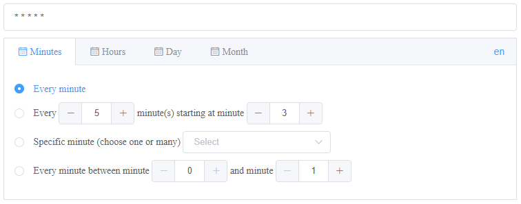

<p align="center">

</p>
<p align="center">
    <em>generate cron expressions using Vue.js</em>
</p>

## Description

The component library is built with Vue 2 allowing for easier editing of cron expressions that are built using a basic cron syntax (classic GNU version, 5 digits).

## Installation

```
npm i cron-editor-vue2
```

## Setup

### Globally

```javascript
import Vue from "vue";
import VueCronEditor from 'cron-editor-vue2'
import ElementUI from "element-ui";
import locale from "element-ui/lib/locale/lang/en";
import "element-ui/lib/theme-chalk/index.css";

Vue.use(VueCronEditor);
Vue.use(ElementUI, { locale });
```

### Locally

```javascript
import VueCronEditor from 'cron-editor-vue2';
export default {
  components: {
    VueCronEditor
  }
}
```

## Usage

```javascript
<template>
  <div id="app">
    <el-input v-model="cronExpression" class="cron-input" />
    <vue-cron-editor v-model="cronExpression" />
  </div>
</template>

<script>
import VueCronEditor from 'cron-editor-vue2';

export default {
  name: "ServeDev",
  components: {
    "vue-cron-editor": VueCronEditor,
  },
  data() {
    return {
      cronExpression: "* * * * *",
    };
  },
};
</script>

<style scoped>
.cron-input {
  margin-bottom: 10px;
}
</style>
```

## Packages

This monorepo includes the following packages:

- Vue 2.0.0+
- element-ui 2.0.0+


## Development

### Install dependencies
```
npm install
```

### Run development server
```
npm run serve
```

### Build
```
npm run build
```

### About the Author
This package was created by Gregory Tsyapa, a software developer at [OSKI solutions](https://oski.site/)

### Attribution

This component is inspired by [vue-cron](https://github.com/1615450788/vue-cron) and [vue-cron-editor-buefy](https://github.com/karoletrych/vue-cron-editor)